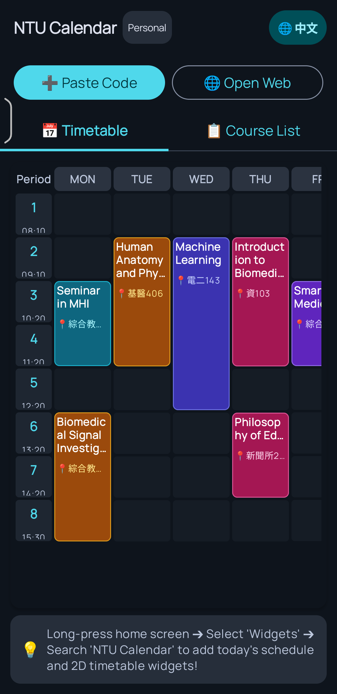

# 臺大課表 Android 原生小工具 App (NTU Course Calendar Android Companion)

本專案為國立臺灣大學（NTU）學生打造之 **Android 原生桌面課表小工具與隨身助手 App**，採用 **Kotlin + Jetpack Compose + Jetpack Compose Glance** 開發。無須依賴 KWGT Pro 等第三方付費工具，安裝 APK 即可於桌面啟用微件，並享有校園館舍導航、課前推播提醒與即時課堂倒數等原生功能。

---

## 相關連結

- 最新 APK 下載專區：[GitHub Releases (版本發布列表)](https://github.com/Annie04082020/ntu-course-calendar/releases)
- 線上課表代碼產生器：[臺大課程日曆好朋友 (GitHub Pages)](https://annie04082020.github.io/ntu-course-calendar/)
- 專案根目錄說明：[專案總覽 README](../README.md)

---

## 功能規格與架構

### 1. 2D 週功課表微件與主畫面 (TimetableGlanceWidget & WeeklyTimetableMatrix)
- 緊湊時間節次軸：左側標註臺大標準節次代碼（1 至 8 / 0 至 D）與開課時間，保留最大橫向顯示空間。
- 頂部星期欄與今日標記：星期標籤（MON 至 FRI），當日動態切換為深藍色發光底色與圓點啟用指示。
- 精確跨節對齊：依課程起訖節次動態跨行延展，未排課時段以整齊微光網格排列。
- 彩色磨砂卡片：課程依名稱雜湊產生專屬色彩主題與邊框，點擊可開啟詳細對話框檢視完整授課教師、備註與大綱。

### 2. 今日節次功課表微件 (TodayGlanceWidget)
- 即時上課狀態倒數：
  - 進行中課堂：醒目標記「進行中 (剩餘 X 分鐘)」。
  - 下一堂課堂：動態計算「下一堂 (X 分鐘後)」倒數。
- 桌面一鍵步行導航：
  - 小工具中每堂課若辨識出教室，右側直接提供專屬「導航」按鈕。
  - 學生於桌面點擊導航，無須開啟 App 即直接喚起 Google Maps 啟動步行導航至該教學大樓。
- 點擊課堂穿透：點擊小工具任一堂課直接啟動 App 並定位該課程之詳細資訊彈窗。

### 3. 校園館舍解析與 Google Maps 步行導航 (CampusBuildings.kt)
- 內建座標字典：收錄博雅、新生、普通、綜合、共同、卓越研究大樓、德田館（資訊系）、明達館、博理館、電機二館、工綜、土木、管一、管二、社科院、霖澤館、萬才館、思亮館、凝態、新體、舊體等 40 餘棟教學研究大樓。
- 教室代碼智慧解析：自動解析 `博101`、`新202`、`普通103`、`綜301`、`管一102`、`德田105` 等常見課表格式，解析出大樓全名與教室樓層。
- 官方步行導航模式：透過 Google Maps Universal URL（`travelmode=walking`）直接啟動步行路線導航。

### 4. 純本地上課前提醒推播 (ClassReminderManager & ClassReminderReceiver)
- 零伺服器與極低耗電：利用 Android 系統級 AlarmManager 本地排程，無背景連網與持續喚醒負擔。
- 自訂提醒時機：於 App 設定中自由選擇「關閉」、「上課前 5 分鐘」或「上課前 10 分鐘」。
- 乾淨簡潔通知：通知列清楚提示即將開始之課程名稱、教室地點與開始時間，點擊直接開啟 App 查看課表。
- 開機自動恢復：透過 BootReceiver 監聽系統重開機廣播（`BOOT_COMPLETED`），開機後自動重新排定未來一週之課堂提醒。
- 權限管理：支援 Android 13+（API 33）執行時期通知權限動態申請。

### 5. 中英雙語即時切換
- App 頂部提供「中文 / EN」即時切換按鈕。
- 2D 週課表與桌面小工具全面支援臺大官方英文課名、授課教師英文名與英文節次標籤。

### 6. 網頁端無縫連動 (Deep Link)
- 支援通訊協定：`ntucourse://import?data=...`。
- 於網頁端點選「一鍵喚起 Android App 同步」即可無縫同步個人課表。
- 支援手動貼上 JSON 代碼匯入，並提供示範課表供離線預覽。

### 7. 資料安全與隱私
- 課表資料僅儲存於裝置本機 SharedPreferences，無任何後端上傳、分析追蹤代碼或身分憑證要求。

---

## 介面實機預覽 (UI Preview)

| 2D 週課表桌面微件 | 今日節次微件 (含即時導航與倒數) |
| :---: | :---: |
|  |  |

| App 內 2D 週功課表主畫面 | 上課提醒設定與課程清單 |
| :---: | :---: |
|  |  |

---

## 下載與安裝指南

1. 前往 [GitHub Releases](https://github.com/Annie04082020/ntu-course-calendar/releases) 下載最新版 `NTU-Course-Calendar-Widget.apk`。
2. 於 Android 裝置開啟檔案進行安裝（若系統出現安全性提示，請選擇允許安裝未知來源應用程式）。
3. 開啟 App，透過網頁一鍵同步或貼上代碼匯入個人課表。
4. 前往手機桌面長按空白處，進入小工具選單，搜尋「臺大課表好朋友」，選擇「2D 週功課表」或「今日節次課表」放置至桌面。
5. 於 App 內「課程清單與設定」可選取上課提醒時間（5 分鐘前 / 10 分鐘前）。

---

## 本地開發與自動化建置

### 環境需求
- 開發工具：Android Studio Ladybug (2024.2) 或更新版本
- JDK：Java Development Kit 17
- 目標版本：compileSdk 34, targetSdk 34, minSdk 26 (Android 8.0+)
- 核心依賴：Jetpack Compose BOM, Jetpack Glance 1.1.0, Gson 2.11.0

### 本地編譯指令
```bash
cd android
./gradlew assembleRelease
```
編譯完成後之 APK 位於 `app/build/outputs/apk/release/`。

### GitHub Actions CI/CD 發布流程
專案配置獨立之 GitHub Actions 腳本（`.github/workflows/android-release.yml`）。推送版本標籤時自動進行編譯、簽名並建立 Release：
```bash
git tag android-v1.0.7
git push origin android-v1.0.7
```
