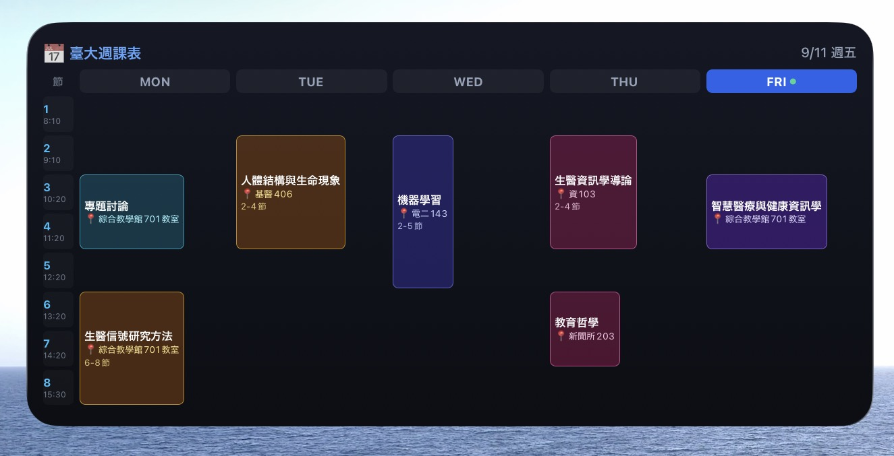

# 臺大課表 iOS / iPadOS Scriptable 桌面小工具

本目錄提供專為國立臺灣大學（NTU）學生設計的 **Scriptable 桌面課表小工具** 腳本與架構說明。

---

## 相關連結

- **線上課表代碼產生器**：[臺大課程日曆好朋友 (GitHub Pages)](https://annie04082020.github.io/ntu-course-calendar/)
- **版本發布專區**：[GitHub Releases](https://github.com/Annie04082020/ntu-course-calendar/releases)
- **Scriptable App 下載**：[App Store (免費)](https://apps.apple.com/app/scriptable/id1405459188)

---

## 介面排版實機範例 (UI Preview - Tool Look)

- **中尺寸微件 (4x2 今日焦點與時間軸)**：
  

- **小尺寸微件 (2x2 精簡下堂課)**：
  

- **迷你尺寸微件 (2x1 即時課堂資訊條)**：
  

---

## 功能規格

### 1. 大尺寸 (Large 4x4) / iPad 特大尺寸 (Extra Large)
- **2D 週課表矩陣**：左側為緊湊的時間與節次標籤（寬度 26pt），頂部為星期標籤（MON 至 FRI）。
- **精準跨節與垂直對齊**：依每門課的實際起訖節次動態跨行延展，填滿小工具垂直空間。
- **長地點自動換行**：地點欄位支援自動折行，避免「綜合教學館 701教室」等較長教室名稱遭到截斷。
- **空白時段網格線**：未排課時段以微光底框呈現，確保視覺網格整齊對齊。
- **當日高亮標記**：當日星期標籤自動切換為高亮膠囊底色並附帶啟用點指示。
- **彩色磨砂卡片**：依課程名稱雜湊產生專屬色彩主題與邊框，點擊可直接連結至臺大課程網。

### 2. 中尺寸 (Medium 4x2)
- **今日焦點**：即時顯示目前上課狀態或下一堂課教室、起訖時間與倒數。
- **今日時間軸**：右側列出今日剩餘課程行程。

### 3. 小尺寸 (Small 2x2)
- **精簡下堂課**：以極簡資訊呈現下一堂課之課名與教室地點。

### 4. 語音輔助
- **Siri 整合**：支援透過語音指令「嘿 Siri，我接下來有什麼課？」即時朗讀當前課程狀態與教室。

### 5. 資料架構與安全性
- **純本地執行**：課表資料直接內嵌於腳本變數中，無第三方伺服器傳輸，確保隱私安全。

---

## 安裝與設定步驟

1. 於 iOS / iPadOS 裝置至 App Store 下載安裝 **Scriptable**。
2. 開啟 [臺大課程日曆好朋友](https://annie04082020.github.io/ntu-course-calendar/) 網頁。
3. 勾選或匯入您的課程後，點擊頂部導航列的「iOS 小工具」。
4. 點擊「一鍵複製 Scriptable 腳本代碼」。
5. 開啟 Scriptable App，點選右上角「+」新增腳本，將代碼貼上並命名為「臺大課表」後儲存。
6. 回到桌面，長按空白處進入編輯模式，點擊左上角「+」搜尋並新增 Scriptable 小工具，將其指定為「臺大課表」腳本即可。
